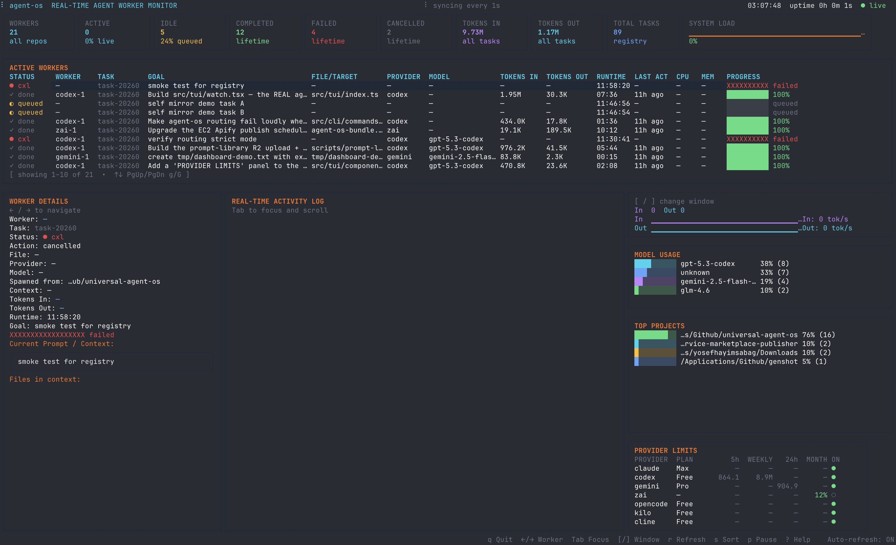

# Universal Agent OS

Standalone TypeScript controller for cloud coding agents. Orchestrates one or more provider workers (Claude, Codex, Gemini, Cline, Kilo, OpenCode, Z.ai, …) inside isolated workspaces, captures diffs and validation results, and surfaces everything through a terminal UI.

## Why

Coding-agent CLIs are powerful in isolation but messy in practice. They edit your tree directly, fill the orchestrator's context with file reads, and offer no shared diffing, validation, or recovery story across providers. Agent OS treats every provider as a worker, runs it in a temp copy or git worktree, and keeps the orchestrator focused on coordination.

## Features

- Multi-provider worker dispatch with per-provider credentials and model catalogs.
- Isolated worker workspaces (temp copy or git worktree) — workers never edit your real tree until the diff is accepted.
- Captured diff, logs, validation, and token usage per task under `.agent-os/`.
- Live TUI with per-worker status, plan detection, and provider rate-limit awareness.
- Pause / resume / recover for crashed terminals or providers.
- Worker completion notifications (wake files, bell, custom commands).
- Orchestrator edit guard that blocks accidental top-level edits and forces delegation to workers.

## Architecture

```
  user CLI (claude / codex / gemini / direct invocation)
            │
            ▼  delegates work
  ┌──────────────────────────────────────────────────────────┐
  │  agent-os controller                                     │
  │  ─ task lifecycle (create → run → validate → diff)       │
  │  ─ context bundle compiler (ranked files + summaries)    │
  │  ─ orchestrator edit guard (subagent bypass)             │
  └──────────────────────────────────────────────────────────┘
            │ spawn worker in isolated workspace
            ▼
  provider adapter ──► temp copy / git worktree ──► diff ──► validators
```

### Orchestrator context preservation

The orchestrator's repo-inspection and edit tools (`Read`, `Grep`, `Glob`, `Edit`, `Write`, `apply_patch`, raw shell `cat/sed/find`, …) are blocked at the top level so the orchestrator's context window does not fill with file reads and worker chatter. When the orchestrator spawns a subagent or worker, the hook reads `parent_tool_use_id` from the tool input and bypasses the guard for that nested call (see `orchestrator-edit-guard.sh:22-104` and the patch at `~/.claude/orchestrator-guard-subagent-bypass.patch`). Workers do real work; the orchestrator stays a coordinator.

### Auto-compaction & summarization

Agent OS does **not** currently auto-compact the orchestrator's own conversation — that is delegated to the host CLI's compaction (Claude Code / Codex provide their own). What it *does* do is summarize repo files when assembling each worker's context bundle: `src/context/compiler.ts:146-201` ranks candidate files, packs the highest-signal ones in full, and falls back to cached summaries (`src/context/file-summary-cache.ts`) once the byte budget is hit. Worker `result.json` payloads carry their own `summary` field which the controller persists; there is no separate orchestrator-side summary rollup yet.

### Hook chain (toolkit side)

Hooks ship with `universal-agent-toolkit` (path varies; on macOS Homebrew it is `/opt/homebrew/lib/node_modules/universal-agent-toolkit/hooks/`):

- `orchestrator-edit-guard.sh` — blocks top-level edits/inspection; bypasses for subagent and worker calls.
- `orchestrator-role.sh` — injects the orchestrator-mode prompt on each `UserPromptSubmit`.
- `pretooluse.sh` / `posttooluse.sh` — wrap tool calls with `dedup-check-file`, dry-guard, lint/typecheck-after-edit, capture-insights.
- `dedup-index-build.sh` — builds the duplicate-code index at session start so the dedup guard has data.

### Lifecycle of a task

1. **Create** — `agent-os task create` records the task in `.agent-os/tasks/<id>/task.json`.
2. **Context bundle** — `compileContext` writes `.agent-os/tasks/<id>/context/bundle.md` with ranked file content plus summary fallbacks.
3. **Run** — controller spawns the provider in an isolated workspace (`mkdtemp` under `os.tmpdir()`, see `src/providers/external-runner.ts:49`; long-running runs use `<runtimeDir>/tasks/<id>/workers/<workerId>` via `src/workspace/temp-copy.ts:40` or `git-worktree.ts:39`).
4. **Diff** — `captureWorkspaceDiff` (`src/workspace/diff.ts`) compares allowed files between source and worker workspace.
5. **Validate** — `src/validators/pipeline.ts` runs: `validateResultSchema`, `scope_check`, `validateNoSecrets`, `validateDependencyGate`, `validateNotNoop`, `validateChangeSize`. Output lands in `.agent-os/tasks/<id>/validation/validation-result.json`.
6. **Accept / reject** — diff is applied to the source tree or discarded; the temp workspace is removed by `worker-cleanup`.

## Vibe code (recommended)

If you do not want to learn the flag surface, do not. Open whatever AI coding CLI you already use — `claude`, `codex`, `gemini` — inside any project and tell it to use agent-os. The `universal-agent-toolkit` hooks (installed automatically with this package) wire orchestrator-mode behavior, the edit guard, and worker dispatch routing into those CLIs, so the CLI itself spawns workers, watches them, and surfaces diffs without you typing a single `agent-os` command. From the user's seat this is the highest-leverage way to use it. The manual `agent-os task …` flow below is fully supported but optional.

The hooks live at `/opt/homebrew/lib/node_modules/universal-agent-toolkit/hooks/` (path varies by platform and package manager).

```
$ cd my-project
$ claude   # or `codex` or `gemini`
> can you use agent-os to add a /health endpoint, run tests, and show me the diff
```

### Watch dashboard preview

Once a worker is running, `agent-os` (no args) launches a live TUI dashboard that shows everything happening across your machine — workers, models in use, provider plan tiers, CPU/RAM, last-active timestamps, and a real-time activity log streaming each worker's stdout.



## Manual quick start

Run from the project you want to operate on:

```bash
agent-os guide
agent-os
```

The TUI path is:

1. Choose `Create + run task`.
2. Enter a literal task goal and an allowed file scope such as `src/**`.
3. Pick a provider and model. For Gemini, use `gemini-2.5-flash-lite` if the default `auto-gemini-3` route is capacity limited.
4. Watch `[universal-agent-os]` live run phases in the terminal.
5. Use `Task logs`, `Task status`, `Task diff`, and `Usage summary` after the run.
6. If a terminal or provider process exits mid-run, use `agent-os task recover` to reconcile running tasks from saved heartbeat/result artifacts.

Scripted flow:

```bash
task_id=$(agent-os task create "create src/example.txt with exactly this content: ok" --allowed-files "src/**" --risk low \
  | node -e 'let s="";process.stdin.on("data",d=>s+=d);process.stdin.on("end",()=>console.log(JSON.parse(s).id))')

agent-os task run "$task_id" --provider gemini --model gemini-2.5-flash-lite
agent-os task validate "$task_id"
agent-os task diff "$task_id"
agent-os task recover "$task_id"
agent-os task logs "$task_id"
agent-os task pause "$task_id"
agent-os task resume "$task_id"
agent-os usage
agent-os upgrade
```

`agent-os task run` writes tagged progress to stderr while preserving the final JSON result on stdout. If a worker run is happening and no `[universal-agent-os]` tag appears, that caller is not using Agent OS for the context bundle and isolated worker handoff.

## Provider setup

Agent OS does NOT bundle these CLIs. Install only the providers you want to use, sign in to each, then Agent OS will detect them automatically (`agent-os onboarding` shows which are detected). All providers are independent products with their own pricing and auth.

| Provider | Install | Auth |
|----------|---------|------|
| claude (Anthropic) | `npm i -g @anthropic-ai/claude-code` | run `claude` (browser OAuth, picks up Pro/Max) |
| codex (OpenAI) | `npm i -g @openai/codex` | `codex login` (ChatGPT account) |
| gemini (Google) | `npm i -g @google/gemini-cli` | first run prompts OAuth |
| opencode | `curl -fsSL https://opencode.ai/install \| bash` | `opencode auth login` |
| kilo | see https://kilocode.ai | provider-specific |
| cline | see https://cline.bot | provider-specific |
| zai | optional, see https://z.ai | optional |
| manual | built-in (no install) | — |

```bash
# macOS quick install (skip any provider you don't use)
npm i -g @anthropic-ai/claude-code @openai/codex @google/gemini-cli
curl -fsSL https://opencode.ai/install | bash
# then sign in to each:
claude    # opens browser
codex login
gemini    # opens browser
opencode auth login
```

Linux users can run the same commands. On Windows the npm packages work cross-platform; the `curl | bash` line needs WSL.

Run `agent-os onboarding` to see which providers are detected on your machine and get sign-in prompts for the missing ones.

Cloud API catalog providers (openrouter, github-models, nvidia-nim, mistral, groq, plus Gemini API-key mode) need credentials through `agent-os providers credentials` or the TUI `Provider API keys` menu — no CLI to install.

Important behavior: providers edit an isolated worker copy. Agent OS saves a task-ranked context bundle before launch, uses file summaries when the byte budget is tight, captures diff, logs, validation, and token usage under `.agent-os/`, and announces those phases with the `[universal-agent-os]` tag; inspect the captured patch with `agent-os task diff <taskId>`.

## Watch dashboard

The TUI watch view aggregates per-worker status, plan-detection events, and provider rate-limit hints in real time. Run `agent-os` and select `Watch tasks` (or run the bundled `scripts/mock-watch.tsx` for a synthetic demo).

### Worker completion notifications

Agent OS can notify external orchestrators when a worker or task finishes.

- **Configuration:** Notifications are configured in `.agent-os/config/notifications.json`. The default configuration is:
  ```json
  {
    "wakeFiles": true,
    "bell": true,
    "commands": []
  }
  ```
- **Wake Files:** If `wakeFiles` is `true`, a JSON file is written to `.agent-os/wakeups/<taskId>-<workerId>.json` upon worker completion. This file contains the event payload and a `finishedAt` timestamp.
- **Bell:** If `bell` is `true` and the terminal is TTY, the BEL character (``) is written to stderr.
- **Commands:** Commands listed in the `commands` array are spawned as detached processes with environment variables `AGENT_OS_TASK_ID`, `AGENT_OS_WORKER_ID`, `AGENT_OS_PROVIDER`, `AGENT_OS_STATUS`, `AGENT_OS_DURATION_MS`, and `AGENT_OS_MESSAGE`.
- **Test Command:** Use `agent-os notifications test` to fire a synthetic notification and view the results.

Pause/recovery behavior: `agent-os task pause <taskId>` persists a paused task state and blocks accidental reruns until `agent-os task resume <taskId>` is called. `agent-os task recover [taskId]` scans running task heartbeats, restores completed/failed state when a worker `result.json` survived a controller crash, and marks stale running workers as `stale` with explicit resume/run commands in the JSON report.

Runtime metadata lives at `.agent-os/runtime.json`. Run `agent-os upgrade` after pulling a newer Agent OS release to apply local runtime migrations explicitly.

### Orchestrator edit guard

The orchestrator edit guard feature blocks direct repo inspection and file mutations at the orchestrator level: Read/Grep/Glob/LS/WebFetch/WebSearch, shell exploration like `rg`/`cat`/`sed`/`find`, Claude Edit/Write/MultiEdit/NotebookEdit, Codex apply_patch, and shell commands that directly write files. This ensures investigation and file modifications are delegated to agent-os workers and subagents.

- **State file path:** The guard's state is stored in `$XDG_CONFIG_HOME/agent-os/orchestrator-block.json` (or `~/.config/agent-os/orchestrator-block.json`).
- **Default:** The guard is enabled by default.
- **CLI commands:** Use `agent-os orchestrator-guard {status,on,off,toggle}` to manage the guard.
- **Per-process bypass:** Set the environment variable `AGENT_OS_GUARD_BYPASS=1` to bypass the guard for a specific process.
- **Hook script:** A matching hook script is available in `universal-agent-toolkit/hooks/orchestrator-edit-guard.sh`.

## Contributing

```bash
pnpm install
pnpm exec tsx src/bin/agent-os.ts doctor
pnpm test
pnpm run build
pnpm lint
pnpm typecheck
```

The implementation plan lives in `plan.md`. New providers go under `src/providers/`, new validators under `src/validators/`, and TUI surfaces under `src/tui/`.

## License

MIT.

## Acknowledgments

Built on the shoulders of the provider CLIs it wraps (Anthropic Claude Code, OpenAI Codex, Google Gemini CLI, Cline, Kilo, OpenCode, Z.ai), Ink for the TUI, and the `universal-agent-toolkit` hook framework.
